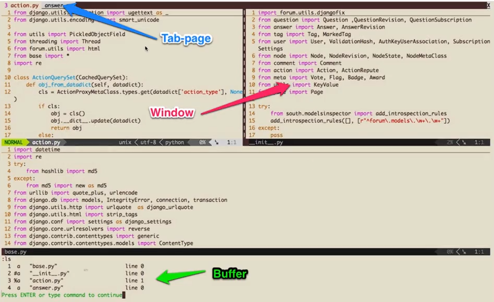
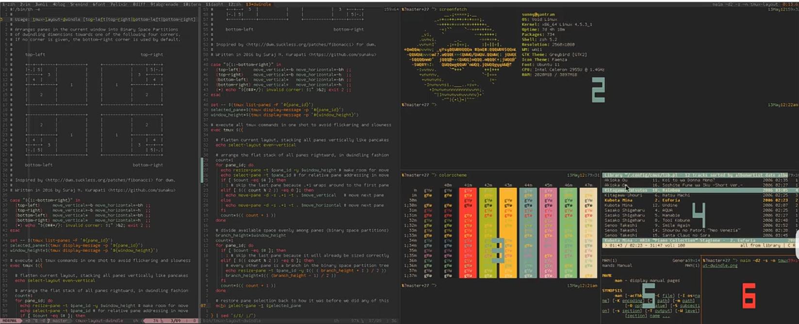

教程：【玩转Vim-从放弃到入门】 https://www.bilibili.com/video/BV1NG4y1p74h/?p=3&share_source=copy_web&vd_source=dd23e37f34be8abeabaf405e07d31ab0

实际上，个人觉得nvim更好用，个人也是使用nvim来进行环境的配置的，因此教程里的东西并不全学，更多的是学习如何丝滑地使用裸的vim。不过，这门课讲的非常之系统，值得反复观看，值得反反复复的去学习。


vim 本身就是个编辑器，这玩意和编译器、调试器一样，必须反反复复的使用，在实践中学会，笔记只是一根拐棍，在你想不起来操作的时候看一眼，等不用看了就学会了。


# vim 基础

掌握裸的vim还是很有必要的，而实际上，**裸的vim也很强大**

- 很多初学者对于vim的基本指令都不熟悉就开始找一些强大的配置，这种行为不利于你熟悉vim，且一旦出了问题你不知道如何修复。

- 初学者还是应该从裸的vim开始学习。

- 掌握裸的vim应该是一个合格程序员的必备技能，毕竟很多场景下比如：在服务器里，或者在容器上，我们可能只能用vim或者vi，且更多的时候我们对于这里的vim是没办法进行配置的。


学习vim之前，应该先校准指法，并且还要**会盲打**。

- 编辑代码，一般情况下，脑子比手快，盲打有利于跟上你大脑的速度
- 学会了vim，很多IDE上也都有vim插件，几乎所有的IDE都支持vim插件（尽管这些插件很多配置起来很麻烦，还有的根本就没法配置，这个时候就得会裸vim了）

## 初识vim

- 在终端输入 `vim` 进入 vim
- 刚进去都是 normal 模式
- 在 normal 模式下输入 `:q` 退出 vim

## 开始编辑

进入编辑模式(insert)就可以像其它编辑器一样编辑了。

- 使用 `i` 进入编辑模式，可以输入文字了

- | 按键 | 含义 |
  | ---- | ---- |
  |  `i`    | insert  |
  |  `a`   | append|
  | `o`  | open a line below|
  | `I` | insert before line|
  | `A` | append after line|
  | `O` |  open a line above|

- 按 `Esc` 回到 normal 模式。 使用 `:wq` 保存退出


## vim 的模式

- 进入vim 默认是 normal 模式
  - 因为你更多的时间是看代码而不是写代码
- 使用 `i` 等键 可以进入 insert 模式
- :[cmd] 命令模式（末行模式、command）
  - 调用常用的命令，比如保存、退出、查找、跳转等。这里的命令有很多，后文会陆续介绍。
- visual 模式
  - " Visual模式是统一的"选择引擎"
    - `v + c` = 选择并修改
    - `v + d` = 选择并删除  
    - `v + y` = 选择并复制
    - `v + >` = 选择并缩进
    - `v + u(U)` = 选择并转小写(大写)
  - 在normal 模式下：
    - `v` 进入 virtual 进行选择
    - `V` 进行 行选择
    - `ctrl + v` 进行块状选择
    - `y`（yank） 复制    
    -  `p`（paste） 粘贴

---

实际上，vim的模式特别多，上述不过仅仅是常见的模式类型，还有很多不常见的。（了解一下就行，主要是为了未来写配置文件的时候会用得上，剩下的时候可能很少特意区分某个模式）

### Vim 模式总览

| 模式         | 快捷键进入             | 主要用途         | 类比其他编辑器       |
| ------------ | ---------------------- | ---------------- | -------------------- |
| **Normal**   | `Esc` 或 `Ctrl+[`      | 导航、命令、操作 | 相当于"命令模式"     |
| **Insert**   | `i`, `a`, `o` 等       | 插入文本         | 普通编辑器的编辑状态 |
| **Visual**   | `v`, `V`, `Ctrl+v`     | 选择文本         | 鼠标拖动选择         |
| **Terminal** | `:terminal` 或 `:term` | 运行终端命令     | 内置终端             |
| **Command**  | `:`                    | 执行Ex命令       | 类似命令行界面       |
| **Replace**  | `R`                    | 替换字符         | 覆盖模式             |

### 详细模式介绍

1. #### Normal 模式（默认模式）

   - 启动时的默认模式
   - 用于**导航、操作、执行命令**
   - **不是输入文本**的模式

   ##### **进入方式**

   ```vim
   从其他模式返回：按 Esc 或 Ctrl+[
   ```

   ##### **常用操作**

   ```vim
   h/j/k/l          # 移动光标
   w/b/e            # 按单词移动
   0/$              # 行首/行尾
   gg/G             # 文件开头/结尾
   
   yy/dd/p         # 复制/删除/粘贴
   u/Ctrl+r         # 撤销/重做
   
   x                # 删除字符
   r{char}          # 替换单个字符
   ```

2. ####  Insert 模式（插入模式）

   - **输入和编辑文本**
   - 类似普通文本编辑器
   - 但功能较少（Vim的强大在Normal模式）

   ##### **进入方式**

   ```vim
   i                # 在光标前插入
   a                # 在光标后插入
   I                # 在行首插入
   A                # 在行尾插入
   o                # 在下方新行插入
   O                # 在上方新行插入
   s                # 删除字符并插入
   S                # 删除整行并插入
   c{motion}        # 删除指定范围并插入
   ```

   ##### **在Insert模式下的有用快捷键** （类emac）

   ```vim
   Ctrl+h           # 删除前一个字符（相当于Backspace）
   Ctrl+w           # 删除前一个单词
   Ctrl+u           # 删除到行首
   
   Ctrl+n/Ctrl+p    # 代码补全
   Ctrl+x ...       # 各种补全（如Ctrl+x Ctrl+f补全文件名）
   
   Ctrl+o           # 执行一个Normal命令后返回Insert模式
   Ctrl+[ 或 Esc    # 返回Normal模式
   ```

3. #### Visual 模式（选择模式）

   ##### **三种子模式**

   ###### **字符选择模式**：

   ```vim
   v               # 进入字符选择
   然后移动光标选择文本
   y/d/c           # 复制/删除/修改选中文本
   ```

   ###### **行选择模式**：

   ```vim
   V               # 进入行选择
   选择整行文本
   ```

   ###### **块选择模式**（列选择）：

   ```vim
   Ctrl+v          # 进入块选择
   选择矩形区域文本
   ```

   ##### **实用技巧**

   ```vim
   gv              # 重新选择上次选中的区域
   ```

4. #### Terminal 模式（终端模式）

   ##### **特点**

   - Neovim 特性（Vim 8.0+也有）
   - **内置终端模拟器**
   - 可以在不离开Vim的情况下运行shell命令

   ##### **进入方式**

   ```vim
   :terminal        # 或 :term
   :split | terminal  # 分屏打开终端
   :vsplit | terminal # 垂直分屏打开终端
   ```

   ##### **终端模式操作**

   ```vim
   在Terminal Buffer中：
   i 或 Ctrl+\ Ctrl+n  # 进入Terminal模式输入
   Ctrl+\ Ctrl+n       # 返回Normal模式
   
   从Normal模式：
   按 i                # 进入Terminal输入模式
   ```

   ##### **退出终端**

   ```bash
   # 在终端中输入 exit 或 Ctrl+d
   exit
   
   # 或从Normal模式关闭缓冲区
   :bd!
   ```

5. #### Command 模式（命令模式）

   ##### **特点**

   - 执行Ex命令
   - Vim的强大管理功能

   ##### **进入方式**

   ```vim
   :                # 从Normal模式进入
   Q                # 从Normal模式直接进入Ex模式（较少用）
   ```

   ##### **常用命令**

   ```vim
   :w               # 保存
   :q               # 退出
   :wq 或 :x        # 保存并退出
   :q!              # 强制退出不保存
   
   :e {file}        # 打开文件
   :bd              # 关闭当前缓冲区
   :ls              # 列出所有缓冲区
   
   :set nu          # 显示行号
   :set nonu        # 隐藏行号
   
   :/pattern        # 搜索
   :%s/old/new/g    # 全局替换
   
   :help {topic}    # 查看帮助
   ```

6. #### Replace 模式（替换模式）

   ##### **特点**

   - 逐个字符替换
   - 输入会覆盖原有字符

   ##### **进入方式**

   ```vim
   R                # 进入替换模式（大写R）
   r{char}          # 替换单个字符（小写r，然后返回Normal模式）
   ```

   ##### **使用场景**

   ```vim
   原文本：Hello World
   光标在H上，按 R 进入替换模式
   输入 Goodbye      # 会逐个字符替换
   结果：Goodbye World
   ```


---


## vim 插入模式的小技巧

### 插入模式下的快速纠错法

在 insert 模式下：

- `ctrl+h` 删除上一个字符
- `ctrl+w` 删除上一个单词
- `ctrl+u` 删除当前光标前本行的所有内容

### 快速切换insert和normal模式

- 这里的建议是自己搞一个键盘，把 `Capslk` 和`Esc` 的位置换一下
- 教程里写过 `ctrl+]` 也行，但是实测不行
- `ctrl+c` 也可以，但是不建议
- `gi` 快速跳转到最后一次编辑的地方并进入insert模式


## 如何在 vim 下快速移动

### 字符之间移动

在 normal 模式下最常见的就是hjkl四个键

- `h` 向左 
- `j`  向下
- `k`向上
- `l`向右


### 单词之间移动

> 术语介绍：
>
> - word ： 以非空白符分割的单词
> - WORD： 以空白符分割的单词

- `w`/`W` 移动到下一个 word/WORD 开头
- `e`/`E` 移动到下一个 word/WORD 结尾
- `b`/`B` 回到上一个 word/WORD  开头 


### 行间搜索移动

更多的时候，在同一行内跳转，都是想跳转到某一个字符。

- 使用 `f{char}` 可以移动到 char 字符上，`t` 移动到 char 的前一个字符。
- 要是第一次没搜索到，可以用 `;` / `,` 继续搜索改行的 下一个/上一个。
- `F` 反过来搜索前面的字符。


### vim 水平移动

如何快速的移动到一行的行首或行尾呢？

- `0` 移动到行首第一个字符
- `^` 移动到第一个非空白字符
-  `$` 移动到行尾
- `g_` 移动到行尾非空白字符 （实测这个键位非常阴间）


### vim 的垂直移动

- `(` `)`  进行句子间移动
- `{` `}`  进行段落之间移动


### vim 的页面移动

- `gg` / `G` 移动到文件开头或者结尾，`ctrl + o` 快速返回上一次编辑的位置
- `H` / `M` / `L` 跳转到 **屏幕** 的 开头(head) / 中间(middle) / 结尾(lower)
- `ctrl + u` `ctrl+f` 上下翻页（upward/forward）
- `ctrl+y`  `ctrl+e` 上下行翻动
- `zz` 把屏幕置为中间


## vim 的快速增删改查

### vim 如何快速进行删除操作？

在 normal 模式下：

- `x` 快速删除一个字符

- `d` (delete) 配合文本对象快速地删除一个文本对象

  - 如： `daw` (delete around word)

    ​		`dd`  删除整行

- 可配合数字重复执行

- 可搭配 virtual 模式使用


### vim 快速修改

相对于删除，我们更常用的是修改，毕竟一般情况下我们都是删除之后改成我们期盼的版本。

在 normal 模式下：

- `r` (replace)  替换一个字符
  - `R` 进入覆盖模式
- `s` (substitute) 替换当前字符并进入插入模式
- `c` (change) 配合文本对象，我们可以快速进行修改
  - 如： `ci'`  删除 ' ' 内的所有内容并进入 insert 模式


### vim 查询

查询单词也是一个常用操作，在 normal 模式下：

- 使用 `/` 或者 `?` 进行前向或者后向搜索
- 使用 `n` / `N` 跳转到下一个 /上一个 匹配
- 使用 `*` / `#` 进行当前单词的前向或者后向匹配
  - 与 `n` / `N` 相比， `*` / `#` 就自动地匹配了当前位置的单词（可见末行命令的变化）

> 搜索结果显示的设置 （末行模式）
>
> `:set hls`   (highlight search)  高亮搜索
>
> `set incsearch`  增量搜索


## vim 的搜索替换

### vim 的替换命令

substitute 命令允许我们查找并替换文本，且支持正则式。

- `:[range]s[ubstitute]/{pattern}/{string}/[flags]`
  - range 表示范围，比如： `10,20` 表示 10-20 行， `%` 表示全部
  - pattern 是要被替换的文本（模式）
  - string 是替换后的文本
  - flags 是替换标志位，常见的标志位：
    - `g`(global) 表示全局范围内执行
    - `c` (confirm) 表示确认，可以确认或拒绝修改
    - `n` (number) 报告匹配的次数而不做任何替换，常用于查询匹配次数


## vim 的多文件操作

> 在 vim 已经打开文件的时候，可以使用 `:e {file_name}` 同时打开另一个文件

### Buffer、Window、Tab

Buffer、Window、Tab 都是涉及到多文件操作时的一些概念。

- Buffer 是指打开的一个文件的内存缓存区
- Window 时 Buffer 可视化的分割区域
- Tab 可以组织窗口为一个工作区



#### Buffer

Buffer 即缓冲区。

- vim 打开一个文件之后会加载文件内容到缓冲区
- 之后的一切修改都是针对内存中的缓冲区，并不是直接保存到文件
- 直到我们执行 `:w` 命令之后才会将修改内容写入文件

##### 如何在 Buffer 之间切换？

- 使用 `:ls` 会列举出当前缓冲区，然后用 `:b{n}` 跳转到第n个缓冲区
- `:bpre`  `:bnext`  `:bfirst`  `:blast`
- `:b {buffer_name}` 加 tab 补全来进行跳转

##### 如何关闭某个Buffer？

| 场景                         | 命令                            | 说明                                             |
| :--------------------------- | :------------------------------ | :----------------------------------------------- |
| **关闭当前缓冲区**           | `:bd` 或 `:bdelete`             | 关闭当前正在编辑的文件，如果有未保存的修改会提示 |
| **强制关闭当前缓冲区**       | `:bd!`                          | 丢弃所有修改，强制关闭                           |
| **关闭所有缓冲区**           | `:%bd`                          | 关闭所有缓冲区（小心使用）                       |
| **关闭除当前外的所有缓冲区** | `:%bd \| e#` 或 `:Bonly` (插件) | 保留当前文件，关闭其他所有                       |
| **关闭包含某关键词的缓冲区** | `:bd /关键词`                   | 例如 `:bd /test` 关闭路径/名称含“test”的缓冲区   |


#### Window

有的时候会同时编辑好多文件，但是Buffer里的文件只能有一个显示在屏幕上，那么假设我们的屏幕充分大，我们如何在一个屏幕上同时显示多个正在编辑的文件呢？这就可以使用 Window 了。

- 一个缓冲区可以被分为多个窗口，每个窗口可以打开不同的缓冲区

- `<ctrl+w>s` 水平分割  (或 `:sp` )

  `<ctrl+w>v` 垂直分割  (或 `:sv` )

- 理论上可以无限分割，前提是你的屏幕够大

##### 如何切换窗口？

跟窗口有关的命令都是使用 `ctrl+w` 作为前缀

| 命令     | 用途             |
| :--------: | ---------------- |
| `<C-w>w` | 在窗口间循环切换 |
| `<C-w>h` | 切换到左边窗口   |
| `<C-w>j` | 切换到下边窗口   |
| `<C-w>k` | 切换到上边窗口   |
| `<C-w>l` | 切换到右边窗口   |


#####  如何重排窗口？

重排窗口即改变窗口大小

|    命令     | 用途                        |
| :---------: | --------------------------- |
|  `<C-w>=`   | 使所有窗口等宽、登高        |
|  `<C-w>_`   | 最大化活动窗口的高度        |
|  `<C-w>|`   | 最大化活动窗口的宽度        |
| `[n]<C-w>_` | 把活动窗口的高度设置为 n 行 |
| `[n]<C-w>|` | 把活动窗口的宽度设置为 n 列 |
| `<C-w>+` | 活动窗口的高度增加一行 |
| `<C-w>-` | 活动窗口的高度减少一行 |
| `<C-w>>` | 活动窗口的宽度增加一列 |
| `<C-w><` | 活动窗口的宽度减少一列 |

**技巧**：

- 在这些快捷键前加数字可以一次性调整多行/列，例如：
	- `5 Ctrl + w +`：高度增加5行
	- `10 Ctrl + w >`：宽度增加10列
- 按住 `Ctrl + w` 不放，再连续按 `+`、`-`、`>`、`<`，窗口就会连续增减大小，**松开即停止**，真正做到“实时调整”。

#### Tab(标签页)

Tab 是可以容纳一系列窗口的容器 （:h tabpage）

- vim 的Tab和其它的编辑器不太一样，可以看作是一个Linux的虚拟桌面
  - 一个Tab全来写python，另一个全来写 HTML
- 相对于窗口，Tab用的较少，因为Tab多了管理起来很麻烦。实际上，很多的功能可以和Tmux配合来完成，不一定非要使用vim原生的功能。（可能以前没有Tmux）

##### Tab 常用操作

Tab 使用的不多，了解一下就行

| 命令 | 用途 |
| :----: | ---- |
| `:tabe[dit] {filename}` | 在新标签页中打开 {filename} |
| `<C-w>T` | 把当前窗口移动到一个新的标签页 |
| `:tabc[lose]` | 关闭当前标签页以及其中的所有窗口 |
| `:tabo[nly]` | 只保留活动标签页，关闭所有其它标签页 |
| `:tabs` | 显示所有标签页编号、当前窗口内容及状态 |

##### Tab 的切换操作

| Ex 命令          | normal 模式命令 | 用途                  |
| ---------------- | --------------- | --------------------- |
| `:tabn[ext]{n}`  | `{n}gt`         | 切换到编号为n的标签页 |
| `:tabn[ext]`     | `gt`            | 切换到下一个标签页    |
| `:tabp[revious]` | `gT`            | 切换到上一个标签页    |


## vim 的 text object (文本对象)

可以直接操作文本对象也是vim里非常方便的一个特性，可以用这个特性快速地操作一个单词、一个句子、一个段落、[ ]内的所有内容、" "内的所有内容……

### Text Object

若是学过主流的编程语言，那就一定知道面向对象的概念

- vim 里文本也有对象的概念，比如一个单词、一段句子、一个段落等，都是一个对象
- 其它编辑器经常只能通过操作单个字符来修改文本，效率较低
- 通过文本对象来修改要比只操作单个字符高效

### 文本对象的操作方式

之前我们就操作国文本对象，比如 `dw` (删除一个单词)

- `[number]<command>[text object]`
  - number 表示次数
  - command 表示命令，如：
    - `d` (delete)
    - `c` (change)
    - `y` (yank)
  - text object 使要操作的文本对象，比如 单词 `w` 、句子 `s` 、段落 `p`

### 文本对象的范围

iw 表示inner word。如果键入 viw 命令，那么首先 v 将进入选择模式，然后 iw 将选中当前单词。

aw 表示a word，它不但会选中当前单词，还会包含当前单词之后的空格。

以下实例中用 [ ] 括起的表示作用范围：

`iw`    This is a [test] sentence.
`aw`    This is a [test ]sentence.
`iW`    This is a [...test...] sentence.
`aw`    This is a [...test... ]sentence.
`is`    ...sentence. [This is a sentence.] This...
`as`    ...sentence. [This is a sentence. ]This...
       End of previous paragraph.

`ip`    [This is a paragraph. It has two sentences.]
      The next.
      End of previous paragraph.

`ap`    [This is a paragraph. It has two sentences.
        ]The next.


**其它示例**：

`i(` or `i)`    1 * ([2 + 3])
`a(` or `a)`   1 * [(2 + 3)]
`i<` or `i>`   The <[tag]>
`a<` or `i>`   The [\<tag\>]
`i(` or `i)`   some {[ code block ]}
`a{` or `a}`   some {[ code block }]
`i[` or `i]`   some [[ code block]]
`a[` or `a]`   some [[ code block]]
`i"`      The "[best]"
`a"`      The ["best"]


## vim 的复制粘贴和寄存器的使用

 vim 的复制粘贴可能比较奇怪，但是我们搞懂vim的寄存器之后，明白了vim复制粘贴的工作原理就不会对此感到奇怪了。

### normal 模式下的复制粘贴

- normal 模式下复制粘贴分别用 `y`(yank) 和 `p` (put) （在当前光标后插入），剪切用 `d` (delete) 
- 还可以使用 `v` 进入 virtual 模式选中要复制的地方，然后使用 `p` 粘贴
- 配合文本对象： 比如 `yiw` 复制一个单词；`yy` 复制一行


### insert 模式下的复制粘贴

在vim的insert模式下，也是 `<C-v>` 粘贴，正常来讲，你电脑正常咋整这个就咋整。（但是这里粘贴之后的内容可能不是你在vim里复制的内容，而是你系统剪切板的内容）

- 这个和其它文本编辑器差不多，但是粘贴代码是个坑
- 很多人在 vimrc 中设置了 autoindent ，但是这会导致粘贴代码时缩进混乱，尤其是对 Python 这种需要严格对齐的代码影响巨大
- 这个时候就需要使用 `:set paste` 和 `:set nopaste` 来解决
  -  `:set paste` ：启用“粘贴模式”。在插入模式下粘贴外部文本（比如从浏览器、其他编辑器复制的内容）时，**防止 Vim 的自动缩进、自动换行、智能缩进等格式化功能干扰粘贴的文本**，确保粘贴的文本与原始内容**完全一致**
  - `:set nopaste`  ： 关闭“粘贴模式”，恢复正常模式。
  - 这个问题可以用插件或映射来解决


### vim的寄存器

为什么在 insert 模式下粘贴的内容可能不是 normal 模式下复制的内容？ normal 模式下复制的内容去哪了？

- 实际上，在 vim 里进行的复制、剪切操作时，被复制、剪切的字符串并不是被存入了系统剪切板，而是vim自己的一个 “无名寄存器”
- 但是在 insert 模式下进行 `<C-v>` 复制的时候，实际上调用的是操作系统的系统剪切板的内容
- 一般情况下，vim 内所有的复制、剪切（vim里没有纯删除，用 `x` 删除一个字符也是剪切）的内容都会存入 “无名寄存器”


#### 深入寄存器

vim 不适用单一的剪切板进行剪切和复制粘贴，而是用多组寄存器

- 通过 `"{register}` 前缀来指定寄存器，不指定就默认无名寄存器

- 如 `"ayiw` 复制单词到寄存器 a 中

  ​    `"bdd` 剪切当前行到寄存器 b 中

  ​    `"ap` 将寄存器 a 的内容粘贴
  
- `""` 表示无名寄存器，一般缺省使用

  `""p` 和 `p`  是完全等价的

> `:reg {register}` 查看指定寄存器内容

  

#### 其它常见寄存器

除了寄存器 a-z ，vim 还有一些其它常见寄存器

- 复制专用寄存器 `"0` 使用 `y` 复制文本同时会被拷贝到复制寄存器 0
- 系统剪切板 `"+` ，可以在复制前加上 `"+` 复制到系统剪切板
  - 可以用 `:echo has('clipboard')` 看看当前vim支不支持这个特性 （一般都是支持的，不支持的话重新编译一个vim）
  - 可以用 `set clipboard=unnamed` 直接复制粘贴系统剪切板里的内容
- 其它寄存器：
  - `"%` 当前文件名
  - `".`  上次插入的文本

 

## 强大的 vim 的宏（macro）

vim 的宏是一种比较高级的用法，可能很多 vimer 都不知道这个特性。但是一旦掌握，可以让你的编辑效率加倍。

> 从需求说起：
>
> 很多时候，我们经常需要抓取一堆网页，有的时候需要给一堆URL加上双引号，这个时候如何做呢？
>
> ```txt
> https://www.zhihu.com/question/54919485
> https://www.zhihu.com/explore
> https://www.zhihu.com/topic
> https://www.zhihu.com/topic/19601308
> https://www.zhihu.com/topic/19607351
> https://www.zhihu.com/topic/19630716
> https://www.zhihu.com/topic/19637932
> https://www.zhihu.com/people/weikexin-67
> https://www.zhihu.com/question/267339149/answer/325252706
> https://www.zhihu.com/question/267339149/answer/523371968
> https://www.zhihu.com/people/zhang-jiahao-15
> https://www.zhihu.com/question/48510028
> https://www.zhihu.com/question/267339149/answer/323414411
> https://www.zhihu.com/people/ming-ming-0701
> https://www.zhihu.com/question/267339149/answer/519709724
> https://www.zhihu.com/question/22897152
> https://www.zhihu.com/question/22130215
> ```
>
> 显然，一个一个地吭哧吭哧地加是一个很愚蠢且很浪费时间的方法。要是几十行还好，这要是成百上千行，得加到什么时候去？
>
> 当然，也可以自己写个脚本来完成，或者交给AI，但是vim本身却提供了一种更快捷的方式。

### 什么是 vim 的宏？

- 宏可以看作是一系列命令的集合
- 我们可以使用宏来 “录制”一些列的操作，然后 “回放”
- 宏可以非常方便的把这一系列命令用在多行文本上

### 如何使用宏？

宏的使用分为 录制和回放 , 在normal模式下：

- 使用 `q` 来开始录制，同时 `q` 也是结束录制
- 使用 `q{register}` 选择要保存的寄存器，把录制的命令保存到该寄存器里
- 使用 `@{register}` 回放寄存器中保存的一系列命令

#### 用宏来解决开头的问题

想给成千上网URL加双引号，可以：

- 先给一行加上双引号，然后在回放到其他行
  1. 先在第一行录制一个给该行加双引号的宏
  2. 按 `V` 进入行选的可视模式，选择所有需要加双引号的URL
  3. 然后对所选行执行normal命令 `:normal @{register}` 


## vim 的补全

（这一节的内容不一定好用，很多都依赖一定的插件）

### 什么是补全？

实际上，只要手速够快，补全什么的都是浮云

- 补全即根据当前环境上下文由编辑器来“猜”你想输入的东西
  - 比如补全一个单词、文件名、代码中的函数名、变量名等
- vim 中提供了多种补全功能，还可以由插件拓展功能实现代码补全

---

### Vim 自带补全功能使用指南

Vim 提供了多种内置补全功能，无需任何插件即可使用。这些功能在 Insert 模式下通过特定快捷键触发。

#### 📋 **补全类型总览**

| 快捷键       | 功能             | 适用场景                         |
| ------------ | ---------------- | -------------------------------- |
| `<C-n>`      | 普通关键字补全   | 当前文件和包含文件中的单词       |
| `<C-p>`      | 反向关键字补全   | 同 `<C-n>`，方向相反             |
| `<C-x><C-n>` | 当前缓冲区关键字 | 仅当前打开的文件                 |
| `<C-x><C-i>` | 包含文件关键字   | `#include` 或 `import` 的文件    |
| `<C-x><C-]>` | 标签文件补全     | 使用 ctags 生成的标签            |
| `<C-x><C-k>` | 字典查找         | 使用 `dictionary` 选项指定的字典 |
| `<C-x><C-t>` | 同义词词典       | 使用 `thesaurus` 选项指定的词典  |
| `<C-x><C-f>` | 文件名补全       | 文件系统中的文件路径             |
| `<C-x><C-d>` | 定义或宏补全     | C/C++ 宏定义                     |
| `<C-x><C-l>` | 整行补全         | 补整个行                         |
| `<C-x><C-o>` | 全能 (Omni) 补全 | 根据文件类型智能补全             |
| `<C-x><C-s>` | 拼写建议         | 拼写错误的单词建议               |
| `<C-x><C-v>` | Vim 命令补全     | 补全 Ex 命令                     |
| `<C-x><C-u>` | 用户自定义补全   | 使用自定义补全函数               |

##### 🚀 **基本使用流程**

###### **1. 普通单词补全（最常用）**

```vim
" 假设缓冲区有这些单词：
" function getUserData() {}
" function getUserInfo() {}
" function processData() {}

" 在 Insert 模式下：
getU  " 输入 getU
<C-n>  " 按 Ctrl+N → 显示 getUserData
<C-n>  " 再按一次 → 显示 getUserInfo
<Enter>  " 确认选择
```

###### **2. 补全菜单导航**

```vim
<C-n>  " 下一个补全项
<C-p>  " 上一个补全项
<C-y>  " 确认选择当前项
<C-e>  " 取消补全菜单
<C-h>  " 删除一个字符（退格）
<C-l>  " 添加一个字符（从当前匹配项）
```

#### 🎯 **详细使用示例**

##### **示例 1：文件名补全**

```vim
" 编辑配置文件时
include "ap<C-x><C-f>
" 会列出所有以 'ap' 开头的文件
" → apache.conf
" → application.yml
" → app.js
```

##### **示例 2：行补全**

```vim
" 假设文件中有这行：
" const user = { name: "John", age: 30, email: "john@example.com" };

" 新行输入：
const userCopy = { n<C-x><C-l>
" 会自动补全为：
" const userCopy = { name: "John", age: 30, email: "john@example.com" };
```

##### **示例 3：字典补全**

```vim
" 首先设置字典
:set dictionary=/usr/share/dict/words

" 编辑时输入：
beau<C-x><C-k>
" 显示：beautiful, beauty, beautifully 等
```

##### **示例 4：全能补全（编程）**

```vim
" Python 文件
import os
os.pa<C-x><C-o>
" 显示：os.path, os.pardir, os.pathconf 等

" HTML 文件
<div cla<C-x><C-o>
" 显示：class, className 等属性
```

#### ⚙️ **重要配置选项**

##### **1. 补全菜单设置**

```vim
" ~/.vimrc 或 init.vim
set completeopt=menuone,noselect  " 始终显示菜单，不自动选择
set pumheight=10                  " 补全菜单最大高度
set shortmess+=c                  " 不显示补全消息
```

##### **2. 补全源配置**

```vim
" 控制 <C-n>/<C-p> 的补全范围
" 格式：set complete=选项1,选项2,...

" 常用选项：
" .   当前缓冲区
" w   其他窗口
" b   其他加载的缓冲区  
" u   未加载的缓冲区
" t   标签文件
" i   当前文件和包含文件
" k   字典
" ]   标签

set complete=.,w,b,u,t,i  " 启用常用补全源
```

##### **3. 特定文件类型配置**

```vim
" Python 全能补全
autocmd FileType python set omnifunc=python3complete#Complete

" JavaScript
autocmd FileType javascript set omnifunc=javascriptcomplete#CompleteJS

" HTML
autocmd FileType html set omnifunc=htmlcomplete#CompleteTags

" CSS  
autocmd FileType css set omnifunc=csscomplete#CompleteCSS
```

#### 🔧 **实用技巧**

##### **技巧 1：补全过程中编辑**

```vim
" 在补全菜单打开时：
appl<C-n>  " 显示 apple, application
<C-l>      " 添加当前选中项的下一个字符
<C-h>      " 删除一个字符
```

##### **技巧 2：使用标签文件**

```bash
# 生成标签文件
ctags -R .

# 在 Vim 中设置
set tags=./tags,tags
```

然后在代码中：
```vim
MyCla<C-x><C-]>  " 补全类名
```

##### **技巧 3：自定义补全**

```vim
" 创建自定义补全函数
function! MyComplete(findstart, base)
    " 返回补全列表
    return ['custom1', 'custom2', 'custom3']
endfunction

set completefunc=MyComplete
" 使用 <C-x><C-u> 触发
```

##### **技巧 4：快速切换补全类型**

```vim
" 输入部分文本后：
<C-x>      " 进入补全模式
<C-n>      " 普通关键字
<C-f>      " 文件名
<C-o>      " 全能补全
<C-l>      " 整行补全
" 等等...
```

#### 🎮 **实战练习**

##### **练习 1：编程补全**

1. 创建 `test.py`：
```python
import os
import sys

def calculate_sum(a, b):
    return a + b

def calculate_product(x, y):
    return x * y
```

2. 新行输入 `cal<C-n>` → 显示两个函数
3. 输入 `os.pa<C-x><C-o>` → 显示 os 模块方法

##### **练习 2：配置补全**

1. 编辑 shell 脚本：
```bash
#!/bin/bash
PATH="/usr/local/bin:/usr/bin:/bin"
HOME="/home/user"
EDITOR="vim"
```

2. 新行输入 `PA<C-n>` → 补全为 `PATH`
3. 输入 `$HO<C-x><C-l>` → 补全整行

#### 🚨 **常见问题解决**

##### **问题 1：补全菜单不出现**

```vim
" 检查设置
:set completeopt?
" 应该是 menuone 或 menu

" 检查补全源
:set complete?
" 应该包含当前缓冲区（.）
```

##### **问题 2：补全项太少**

```vim
" 增加补全源
:set complete+=i  " 包含文件
:set complete+=t  " 标签文件
:set complete+=k  " 字典
```

##### **问题 3：补全太慢**

```vim
" 减少补全源
:set complete=.,b  " 仅当前和加载的缓冲区

" 限制标签文件大小
:set taglength=20  " 只匹配前20个字符
```

##### **问题 4：特定文件类型补全无效**

```vim
" 检查文件类型
:set filetype?

" 检查 omnifunc 设置
:set omnifunc?

" 安装对应补全支持
" Python: pip install pynvim
" JavaScript: 安装 nodejs
```

#### 📚 **高级功能**

##### **1. 补全预览窗口**

```vim
set completeopt+=preview  " 显示额外信息
" 使用 <C-x><C-o> 时会显示函数签名等
```

##### **2. 补全过滤**

```vim
" 使用正则过滤补全项
:set complete-=i  " 临时禁用包含文件
```

##### **3. 补全后动作**

```vim
" 自动添加括号等
inoremap <expr> <C-y> pumvisible() ? "\<C-y>\<C-r>=\"()\<Left>\"" : "\<C-y>"
```

---


## 给vim换个配色

很多的现代化编辑器都支持更换主题，vim当然也可以

- `:colorscheme` 显示当前主题配色，默认是 default
- `:colorscheme <C+d>` 可以显示所有主题配色
- 有了中意的配色之后， 用 `:colorscheme {scheme_name}` 就可以修改配色

- 还可以从网上下载更好看的配色 （https://github.com/flazz/vim-colorschemes）


---

到此为止，裸vim的操作就差不多结束了。

我用的是neovim，对其进一步的配置在[这里](./02_nvim配置.md)。

---


# 与vim配合的好用的工具

## vim和Tmux 天作之合

Tmux 是一种强大的终端复用工具



- 可以复用终端、分屏】托管进程等
- 在服务器上即使退出服务器也不会被kill，托管进程也很方便
- 可以方便地分割屏幕，实现多个进程共用屏幕

关于Tmux的进一步使用，在[这里](./03_Tmux.md)


## 与时俱进的neovim

neovim是fork vim项目的一个新的分支，毕竟传统的vim代码过于老旧、难以重构；不支持异步特性，在使用一些插件的时候就可能阻塞我们的编辑，造成卡顿。

- https://neovim.io
- 开发更加活跃，更丰富的特性和扩展，异步支持
- neovim的设计可以嵌入到很多的GUI里，加上更好看的“外壳”