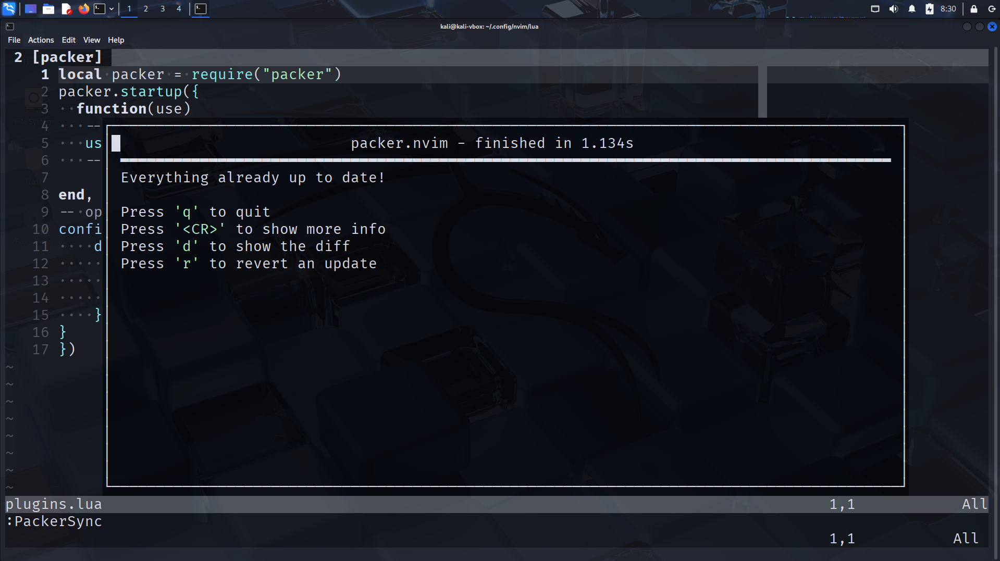

nvim 配置教程：[Neovim 配置实战：从0到1打造自己的IDE - 程序员nshen - 掘金小册](https://juejin.cn/book/7051157342770954277)


使用vscode也好，使用 vim/nvim 也好，我想都是随着学习的深入，学的内容逐渐驳杂，每一位 CSer 都渴望抛弃那些笨重且复杂的IDE，并使用一个超级好用的编辑器统一开发环境。vscode是一个很好的编辑器，但是我重新捡起vim还是因为我实在是忍受不了它天天强制更新了，我特别需要一个稳定的开发环境！！！想起了当年用 vim 的时光 ，我决定把这个捡起来，也算是弥补了当年配置vim配了一个礼拜，结果还没有vscode好用的遗憾。

由于很多原因，我想把物理机的操作系统换成Linux的某个发行版的愿望一直没有完成，但是 vim/nvim 基本上都只能在 Linux 上使用，在Windows的 powershell 上使用一直很费劲 —— 这玩意不配置还好，一配置 Windows 就会出现各种各样的问题。 不过也是通过这篇教程，我知道了还有 WSL 这种神器……很多的问题基本上都被迎刃而解！！！ 这 14.95￥ 花的值！！！

这里就记录一些我学习时的笔记。


neovim的配置是用 lua 语言写的，lua语言语法也不难，学过C、python的基本上都能看懂，[这里](./04_lua.md)是lua的简单的介绍。（不看也行，lua的语法只要有些编程基础就能看得懂）


# 配置总览

```txt
├── LICENSE
├── README.md
├── init.lua    // 配置入口，负责引用所有其他的模块，打开或关闭某个插件只要在这里修改一行代码即可。
└── lua
    ├── autocmds.lua
    ├── basic.lua    // 基础配置，是对默认配置的一个重置。
    ├── colorscheme.lua   // 我们安装的主题皮肤配置，在这里切换主题。
    ├── keybindings.lua    // 快捷键的设置，所有插件的快捷键也都会放在这里。
    ├── lsp    // 是对 Neovim 内置 LSP 功能的配置，包括常见编程语言与语法提示等。
    │   ├── cmp.lua    //  语法自动补全补全的配置，包括各种补全源，与自定义代码段。
    │   ├── config    // 文件夹包含各种语言服务器单独的配置文件。
    │   │   ├── bash.lua
    │   │   ├── emmet.lua
    │   │   ├── html.lua
    │   │   ├── json.lua
    │   │   ├── lua.lua
    │   │   ├── markdown.lua
    │   │   ├── pyright.lua
    │   │   ├── rust.lua
    │   │   └── ts.lua
    │   ├── formatter.lua    // 独立代码格式化功能。
    │   ├── null-ls.lua
    │   ├── setup.lua    // 内置 LSP 的配置。
    │   └── ui.lua    // 对内置 LSP 功能增强和 UI 美化。
    ├── plugin-config    // 对第三方插件的配置，未来每添加一个插件，这里就多一个配置文件。
    │   ├── bufferline.lua   // 底下的文件都是教程作者的，我不一定有
    │   ├── comment.lua   // 这个文件夹单独写每个插件的配置
    │   ├── dashboard.lua
    │   ├── gitsigns.lua
    │   ├── indent-blankline.lua
    │   ├── lualine.lua
    │   ├── nvim-autopairs.lua
    │   ├── nvim-tree.lua
    │   ├── nvim-treesitter.lua
    │   ├── project.lua
    │   ├── surround.lua
    │   ├── telescope.lua
    │   ├── toggleterm.lua
    │   ├── vimspector.lua
    │   └── which-key.lua
    ├── plugins.lua
    └── utils    //  是对常见问题的修改，包括输入法切换，针对 windows 的特殊配置等。
        ├── fix-yank.lua
        ├── global.lua
        └── im-select.lua
```

# 基础配置项

## 配置入口文件

Neovim 配置文件入口与 VIM 不太一样，不是 `.vimrc` 。而是保存在用户Home目录中的 `~/.config/nvim/init.lua` 文件， 也可以是用 VIM 脚本写的 `init.vim` 文件。

`init.vim` 全兼容  `.vimrc` 。通常是vim向neovim的过度者才用这个。我没有什么历史遗留，所以就全用lua来写。

### 在.vim文件中调用lua

由于我没有历史遗留，所以这里的内容没有经过实践的检验，就是简单的记录一下，防止未来看不懂别人的配置。

```vim
# 单行调用
lua print('单行lua')

# 多行调用
lua <<EOF
print('多行lua')
print('多行lua')
print('多行lua')
EOF
```

当然了，也可以在lua种调用vim脚本：

```lua
vim.cmd([[
-- vimscript here
]])
```


### 配置入口 init.lua

可能你的 `~` 下没有 `~/.config/nvim/init.lua` ，甚至 `.config` 都没有（我就是），不过不要紧，从头开始，直接 `mkdir` 一个就行。

init.lua 是我们nvim配置的开始入口，相当于C/C艹 语言里的主函数。模块化编程嘛，所以未来那些功能打开，哪些功能关闭，都是在这里设置的。 也就是说，init.lua 就负责统筹各个子模块，那么如何实现呢？

```lua
require('basic')
```

答案是通过`require`函数来进行实现。`require` 函数用于加载一个模块，这些模块通常位于 `runtimepath` 中的 `lua/` 目录下，也就是我们的 `~/.config/nvim/lua/` 目录。

把上述代码写到 `init.lua` 的第一行，这样，basic模块的所有功能就都被启用了。（要是把这句话注了，该模块就失效了）

### 基础配置文件 basic.lua

然后，创建 `~/.config/nvim/lua/` 目录，在该目录下新建 `basic.lua`

见名知意，这个模块就是负责nvim的最基础的配置的

在这里，添加内容如下 (根据自己需求，不用的注了就行)：

```lua
-- utf8
vim.g.encoding = "UTF-8"
vim.o.fileencoding = 'utf-8'

-- jkhl 移动时光标周围保留8行
vim.o.scrolloff = 8
vim.o.sidescrolloff = 8

-- 使用相对行号
vim.wo.number = true
vim.wo.relativenumber = true

-- 高亮所在行
vim.wo.cursorline = true

-- 显示左侧图标指示列
vim.wo.signcolumn = "yes"

-- 右侧参考线，超过表示代码太长了，考虑换行
vim.wo.colorcolumn = "80"

-- 缩进2个空格等于一个Tab
vim.o.tabstop = 2
vim.bo.tabstop = 2
vim.o.softtabstop = 2
vim.o.shiftround = true

-- >> << 时移动长度
vim.o.shiftwidth = 2
vim.bo.shiftwidth = 2

-- 空格替代tab
vim.o.expandtab = true
vim.bo.expandtab = true

-- 新行对齐当前行
vim.o.autoindent = true
vim.bo.autoindent = true
vim.o.smartindent = true

-- 搜索大小写不敏感，除非包含大写
vim.o.ignorecase = true
vim.o.smartcase = true

-- 搜索不要高亮
vim.o.hlsearch = false

-- 边输入边搜索
vim.o.incsearch = true

-- 命令行高为2，提供足够的显示空间
vim.o.cmdheight = 2

-- 当文件被外部程序修改时，自动加载
vim.o.autoread = true
vim.bo.autoread = true

-- 禁止折行
vim.wo.wrap = false

-- 光标在行首尾时<Left><Right>可以跳到下一行
vim.o.whichwrap = '<,>,[,]'

-- 允许隐藏被修改过的buffer
vim.o.hidden = true

-- 鼠标支持
vim.o.mouse = "a"

-- 禁止创建备份文件
vim.o.backup = false
vim.o.writebackup = false
vim.o.swapfile = false

-- smaller updatetime
vim.o.updatetime = 300

-- 设置 timeoutlen 为等待键盘快捷键连击时间500毫秒，可根据需要设置
vim.o.timeoutlen = 500

-- split window 从下边和右边出现
vim.o.splitbelow = true
vim.o.splitright = true

-- 自动补全不自动选中
vim.g.completeopt = "menu,menuone,noselect,noinsert"

-- 样式
vim.o.background = "dark"
vim.o.termguicolors = true
vim.opt.termguicolors = true

-- 不可见字符的显示，这里只把空格显示为一个点
vim.o.list = true
vim.o.listchars = "space:·"

-- 补全增强
vim.o.wildmenu = true

-- Dont' pass messages to |ins-completin menu|
vim.o.shortmess = vim.o.shortmess .. 'c'

-- 补全最多显示10行
vim.o.pumheight = 10

-- 永远显示 tabline
vim.o.showtabline = 2

-- 使用增强状态栏插件后不再需要 vim 的模式提示
vim.o.showmode = false
```


当然了，这里通常直接照抄就行，底下有很详细的说明。（也可以不看）


#### Neovim Lua API 作用域详解

##### 全局作用域接口

###### vim.g.{name} - 全局变量

主要使用场景：

插件全局配置：
```lua
vim.g.mapleader = " "
vim.g.maplocalleader = ","
vim.g.nvim_tree_auto_close = 1
```

全局状态存储：
```lua
vim.g.project_root = vim.fn.getcwd()
vim.g.debug_mode = false
```

适用情况判断：
- 整个编辑会话中保持一致的配置
- 多个插件共享的配置值
- 影响编辑器整体行为的标志

###### vim.o.{option} - 全局选项

主要使用场景：

编辑器核心行为：
```lua
vim.o.mouse = "a"
vim.o.clipboard = "unnamedplus"
vim.o.ignorecase = true
vim.o.updatetime = 300
```

适用情况判断：
- 影响所有编辑操作的基础设置
- 搜索、替换等全局功能
- 性能调优参数

##### 缓冲区作用域接口

###### vim.b.{name} - 缓冲区变量

主要使用场景：

缓冲区特定数据：
```lua
vim.b.current_language = "python"
vim.b.has_lsp = true
vim.b.last_edit_time = os.time()
vim.b.did_format = false
```

实用示例：

跟踪编辑历史：
```lua
vim.api.nvim_create_autocmd("BufWritePost", {
    callback = function()
        vim.b.last_saved = os.date("%Y-%m-%d %H:%M:%S")
        vim.b.edit_count = (vim.b.edit_count or 0) + 1
    end
})
```

适用情况判断：
- 文件特定的状态跟踪
- 临时标志和缓存
- 文件类型相关的逻辑判断

###### vim.bo.{option} - 缓冲区选项

主要使用场景：

文件类型配置：
```lua
vim.bo.tabstop = 4
vim.bo.shiftwidth = 4
vim.bo.expandtab = true
vim.bo.fileencoding = "utf-8"
vim.bo.syntax = "python"
```

文件类型自动配置：

```lua
vim.api.nvim_create_autocmd("FileType", {
    pattern = "python",
    callback = function()
        vim.bo.tabstop = 4
        vim.bo.shiftwidth = 4
        vim.bo.textwidth = 88
    end
})
```

适用情况判断：
- 每个文件应该有不同的设置
- 代码格式化相关选项
- 语法和文件编码设置

##### 窗口作用域接口

###### vim.w.{name} - 窗口变量

主要使用场景：

窗口状态管理：
```lua
vim.w.last_cursor_pos = {1, 1}
vim.w.preview_open = false
vim.w.split_orientation = "vertical"
```

实用示例：

保存和恢复窗口状态：
```lua
vim.api.nvim_create_autocmd("WinLeave", {
    callback = function()
        vim.w.last_cursor_pos = vim.api.nvim_win_get_cursor(0)
    end
})
```

适用情况判断：
- 窗口特定的 UI 状态
- 分屏和布局管理
- 临时窗口标记

###### vim.wo.{option} - 窗口选项

主要使用场景：

显示和视觉设置：
```lua
vim.wo.number = true
vim.wo.relativenumber = true
vim.wo.cursorline = true
vim.wo.wrap = false
vim.wo.signcolumn = "yes"
vim.wo.colorcolumn = "80,120"
```

滚动和折叠：
```lua
vim.wo.scrolloff = 8
vim.wo.sidescrolloff = 8
vim.wo.foldmethod = "indent"
```

适用情况判断：
- 影响当前窗口显示效果的设置
- 滚动和视口控制
- 行号和辅助列的显示

##### 配置实战指南

###### 配置原则总结

作用域选择原则：

最小作用域原则：
```lua
-- 错误：全局设置缓冲区特定值
vim.o.tabstop = 4

-- 正确：使用缓冲区选项
vim.bo.tabstop = 4
```

作用域层级关系：

```
全局 (g/o) → 影响所有
  ↓
窗口 (w/wo) → 影响当前窗口
  ↓
缓冲区 (b/bo) → 影响当前文件
```

###### 常见配置模式

基础配置模板：

```lua
-- 全局配置层
vim.o.mouse = "a"
vim.o.clipboard = "unnamedplus"
vim.g.mapleader = " "

-- 窗口显示层
vim.wo.number = true
vim.wo.relativenumber = true

-- 文件类型配置层
vim.api.nvim_create_autocmd("FileType", {
    pattern = "python",
    callback = function()
        vim.bo.tabstop = 4
        vim.bo.shiftwidth = 4
        vim.wo.colorcolumn = "88"
        vim.b.is_python_file = true
    end
})
```

状态管理示例：

```lua
-- 全局状态
vim.g.editor_mode = "normal"

-- 缓冲区编辑历史
vim.api.nvim_create_autocmd("TextChanged", {
    callback = function()
        vim.b.edit_timestamp = os.time()
    end
})

-- 窗口布局记忆
vim.api.nvim_create_autocmd("WinEnter", {
    callback = function()
        vim.w.enter_time = os.time()
    end
})
```

###### 错误避免指南

典型错误模式：

```lua
-- 作用域混淆
vim.wo.filetype = "python"

-- 全局过度使用
vim.o.tabstop = 4

-- 变量选项混淆
vim.b.number = true

-- 临时数据用全局
vim.g.current_cursor_pos = {1, 1}
```

正确模式参考：

```lua
-- 正确示例集合
vim.bo.filetype = "python"
vim.wo.number = true
vim.b.has_changes = true

vim.api.nvim_create_autocmd("BufEnter", {
    pattern = "*.py",
    callback = function()
        vim.bo.tabstop = 4
        vim.wo.colorcolumn = "88"
        vim.b.python_file = true
    end
})
```

##### 快速参考手册

###### 决策流程图

```
开始设置
  ↓
是否影响所有编辑器行为？
  ├─ 是 → vim.o.{option}
  └─ 否 → 是否只影响显示？
         ├─ 是 → vim.wo.{option}
         └─ 否 → 是否文件特定？
                ├─ 是 → vim.bo.{option}
                └─ 否 → 是否需要存储状态？
                       ├─ 是 → 窗口还是缓冲区？
                       │      ├─ 窗口 → vim.w.{name}
                       │      └─ 缓冲区 → vim.b.{name}
                       └─ 否 → 插件配置或全局状态 → vim.g.{name}
```

###### 记忆口诀

"Go Broad, Be Window-Oriented, But Opt Carefully"
- Global (g/o) - 全局
- Buffer (b/bo) - 缓冲区  
- Window (w/wo) - 窗口
- Options (o/bo/wo) - 选项
- Names (g/b/w) - 变量名

###### 实用速查表

| 你需要设置... | 使用接口 | 示例                   |
| ------------- | -------- | ---------------------- |
| 插件全局配置  | vim.g    | vim.g.mapleader = " "  |
| 编辑器行为    | vim.o    | vim.o.mouse = "a"      |
| 文件缩进      | vim.bo   | vim.bo.tabstop = 4     |
| 行号显示      | vim.wo   | vim.wo.number = true   |
| 文件状态标记  | vim.b    | vim.b.modified = true  |
| 窗口位置记忆  | vim.w    | vim.w.last_pos = {1,1} |

---


# 在neovim中设置快捷键以提升开发效率

快捷键的设置在 `lua/keybindings.lua` 文件中

我的配置和作者不一样，我尽量不改vim的原生功能，因为我觉得裸的vim也很好用。我只添加一些好用的映射

## 如何在 Neovim 中设置快捷键？

```lua
vim.api.nvim_set_keymap()   -- 全局快捷键
vim.api.nvim_buf_set_keymap()   -- Buffer 快捷键
```

- **一般情况下，都是定义使用全局快捷键**

- Buffer 快捷键一般是在某些异步回调函数里指定，例如某插件初始化结束后，会有回调函数提供 Buffer，这个时候我们可以只针对这一个 Buffer 设置快捷键。


## 全局设置：

```lua
vim.api.nvim_set_keymap('模式', '按键', '映射为', 'options')
```

- 这里 **模式** 参数用一个字母表示，常见的有：
  - **n** Normal 模式
  - **i** Insert 模式
  - **v** Visual 模式
  - **t** Terminal 模式
  - **c** Command 模式

- **按键** 就是你按下的键。

- **映射为** 可以是多个按键组合，比如 `5j` 就是连续点击`5`和`j`， 也可以是一条命令比如 `:q<CR>`，表示退出。

- **options** 大部分会设置为 `{ noremap = true, silent = true }`。
  - `noremap` 表示不会重新映射，比如你有一个映射 `A` -> `B` , 还有一个 `B` -> `C`，这个时候如果你设置 `noremap = false` 的话，表示会重新映射，那么 `A` 就会被映射为 `C`。
  - `silent` 为 `true`，表示不会输出多余的信息。

## Leader Key

**Vim 的默认 leader 键是：反斜杠 `\`**

`leader key` 是你常用的前缀，这里我学教程设置为 `空格`

```lua
vim.g.mapleader = " "
vim.g.maplocalleader = " "
```

后边定义快捷键看到 `<leader>` 就表示 `空格` 。

由于要设置很多快捷键，所以先保存本地变量。

```lua
local map = vim.api.nvim_set_keymap
-- 复用 opt 参数
local opt = {noremap = true, silent = true }
```

之后就可以这样映射按键了

```lua
map('模式', '按键', '映射为', 'options')
```


## virtual 模式移动代码功能

在 visual 模式下可以`J` `K` 上下移动代码，又增加了连续 `>` 或 `<` 缩进代码。

```lua
-- visual模式下缩进代码
map("v", "<", "<gv", opt)
map("v", ">", ">gv", opt)
-- 上下移动选中文本
map("v", "J", ":move '>+1<CR>gv-gv", opt)  -- '> 选择结束的行
map("v", "K", ":move '<-2<CR>gv-gv", opt)  -- '<  选择开始的行 
```

map 的第一个参数 `v` 表示 visual 模式。

- **`:move` 命令的意思是**：

  > "把选中的行，移动到**指定行号的下方** ，所以往上移是 `'<-2<`

- `gv-gv` 里的 `-` 是在normal模式下的命令，会跳转到上一行第一个非空白字符，在这里就是选中区域的第一行的非空白字符


# 安装和管理插件

目前在 Neovim 最常见的插件管理器主要有 [vim-plug](https://github.com/junegunn/vim-plug) 和 [packer.nvim](https://github.com/wbthomason/packer.nvim) 两个。

由于 packer.nvim 是全lua编写的，我这里就学教程作者，也用这个。


> 安装组件的流程： 修改 `lua/plugins.lua` 文件，保存退出，重新打开并调用 `:PackerSync`

## Packer.nvim 插件管理器的安装与插件安装流程

按照官网说明，使用如下命令安装：

```shell
git clone --depth 1 https://github.com/wbthomason/packer.nvim\
 ~/.local/share/nvim/site/pack/packer/start/packer.nvim
```

安装成功后，我们添加一个新的配置文件，专门用于管理插件，新建 `lua/plugins.lua` 为如下代码：

```lua
local packer = require("packer")
packer.startup(
  function(use)
   -- Packer 可以管理自己本身
   use 'wbthomason/packer.nvim'
   -- 你的插件列表...
end)
```

- 我们通常使用 `use 'name/repo'` 来安装插件，`name/repo` 对应`github` 的地址。

  - 例如上边代码中的 `use 'wbthomason/packer.nvim'`，对应的就是 `https://github.com/wbthomason/packer.nvim` 地址。

- 安装插件要求你有一个稳定可联通 Github 的网络环境，如果你的网络不好，可以尝试设置第二个 config 参数，使用代理站点。

- 下边代码中列出了目前常见的几个代理站点，但还是推荐使用 Github， 因为代理站点有些冷门的插件有可能没有同步，或者同步不及时，也有可能有并发数限制等，体验并不是很好。

  ```lua
  local packer = require("packer")
  packer.startup({
    function(use)
      -- Packer 可以管理自己本身
      use 'wbthomason/packer.nvim'
      -- 你的插件列表...
    end,
    config = {
      -- 并发数限制
      max_jobs = 16,
      -- 自定义源
      git = {
        -- default_url_format = "https://hub.fastgit.xyz/%s",
        -- default_url_format = "https://mirror.ghproxy.com/https://github.com/%s",
        -- default_url_format = "https://gitcode.net/mirrors/%s",
        -- default_url_format = "https://gitclone.com/github.com/%s",
      },
    },
  })
  ```

  - `config` 中还有很多参数，具体可参考帮助文档 (`:help packer`)，比较实用的还有，以浮动窗口打开安装列表：

    ```lua
    config = {
        display = {
            open_fn = function()
                return require("packer.util").float({ border = "single" })
            end,
        },
    }
    ```

配置完成后，`:wq` 保存文件并退出。

别忘了想要这个配置文件生效，必须在 **入口文件** 中引入才可以， 打开 `init.lua` 增加如下代码：

```lua
-- Packer 插件管理
require("plugins")
```

再次 `:wq` 后，配置生效。

配置生效后，Neovim 会增加以下命令。

- `:PackerCompile`： 每次改变插件配置时，必须运行此命令或 `PackerSync`, 重新生成编译的加载文件
- `:PackerClean` ： 清除所有不用的插件
- `:PackerInstall` ： 清除，然后安装缺失的插件
- `:PackerUpdate` ： 清除，然后更新并安装插件
- `:PackerSync` : 执行 `PackerUpdate` 后，再执行 `PackerCompile`
- `:PackerLoad` : 立刻加载 opt 插件

通过上边的说明，我们观察到 `:PackerSync` 命令包含了 `:PackerUpdate` 和`:PackerCompile`，而 `:PackerUpdate` 又包含了 `:PackerClean` 和 `:PackerInstall` 流程。

所以通常情况下，无论**安装**还是**更新**插件，我只需要下边这一条命令就够了。

**`:PackerSync`**

每次修改完 `lua/plugins.lua` 这个文件后，保存退出，重新打开并调用 `:PackerSync` 就可以了，只要你的网络可以连接到 github ，插件就会安装成功。

## 插件安装的位置

Neovim 推荐将数据存储在 **标准数据目录**下（`:h base-directories` 查看详细文档），**标准数据目录**默认是 `~/.local/share/nvim/` ，你可以通过调用 `:echo stdpath("data")` 命令查看你系统下的实际路径。

`Packer` 会将插件默认安装在 `标准数据目录/site/pack/packer/start` 中，完整目录也就是`~/.local/share/nvim/site/pack/packer/start` 目录下。

你现在可以进入这个目录，查看一下安装的插件，应该看到只安装了 `packer.nvim` 一个插件，后续安装的插件也都会出现在这个目录中。

## 添加自动安装

打开 `lua/plugins.lua` 文件，在最后添加：

```lua
-- 每次保存 plugins.lua 自动安装插件
pcall(
  vim.cmd,
  [[
    augroup packer_user_config
    autocmd!
    autocmd BufWritePost plugins.lua source <afile> | PackerSync
    augroup end
  ]]
)
```

这里的 `[[ ... ]]` 中间的部分是 VIM 脚本，因为 Neovim 还没有实现自动命令的 API，所以我们需要使用 `vim.cmd` 命令来执行这段脚本。

这段脚本的意思是 `BufWritePost` 事件时，如果改的是 `lua/plugins.lua` 文件，就自动重新加载并调用 `:PackerSync` 命令，这样就不用手动重启，可以自动安装插件了。

`pcall` 命令是一个 Lua 函数，它的作用是检查一个函数是否执行成功，如果执行成功，则返回 `true`，否则返回 `false` ，防止报错。

现在修改 `lua/plugins.lua` 后输入 `:w` 就会自动安装和更新插件了。

一切都搞好之后会出现差不多这样的界面：



# 主题配色

- Neovim 本身内置了一些主题配色，你可以通过 `:colorscheme Tab键` 命令来查看， 回车确认选中。
  - 这些内置的 `colorscheme`，它们都保存在 `$VIMRUNTIME/colors/` 目录下

## 配置主题

先在 init.lua 里加上：

```lua
-- 主题设置 （新增）
require("colorscheme")
```

新建被引入的 `lua/colorscheme.lua` 文件，代码如下：

```lua
local colorscheme = "tokyonight"  -- 实际上，这个主题并不存在
local status_ok, _ = pcall(vim.cmd, "colorscheme " .. colorscheme)
if not status_ok then
  vim.notify("colorscheme " .. colorscheme .. " 没有找到！")
  return
end
```

解释一下上面的代码：

- `pcall` 在 Lua 中用于捕获错误，这句话如果不用`pcall` 的话，相当于：
	```lua
	vim.cmd('colorscheme '.. colorscheme)
	```

- Lua 语言中用 `..` 来连接两个字符串。
  
- 上边已经声明了 `colorscheme` 变量也是一个字符串 `"tokyonight" `所以这里其实就等于调用 `:colorscheme tokyonight` 命令。 但如果这样直接调用命令，如果主题不存在，Neovim 就会直接崩溃报错找不到该主题，程序中也就没法知道主题是否设置成功了。
  
- 使用 `pcall` 的话就不同了，`pcall` 函数的返回的第一个参数是 `boolean` 类型表示状态，这句话的意思是，如果 `colorscheme` 执行成功，则返回 `true`，否则返回 `false`。

  如果没有设置成功，我们就让它输出信息：
	```lua
	vim.notify("colorscheme " .. colorscheme .. " 没有找到！")
	```

## 安装第三方主题

打开 `lua/plugins.lua` 文件，增加 colorschemes 部分：

```lua
packer.startup({
  function(use)
    -- Packer 可以升级自己
    use("wbthomason/packer.nvim")
    --------------------- colorschemes --------------------
    -- tokyonight
    use("folke/tokyonight.nvim")
    -------------------------------------------------------

    -- 略...
})
```

`:w` 保存，如果顺利的话，会自动安装，完成后按 `q` 退出，重启后就可以看到 `tokyonight` 主题的样子了。

通常我们都会选择专门为 Neovim 制作的第三方主题，因为它们大多都会支持基于 `TreeSitter` 的语法高亮（后续代码高亮章节会详细说明），我认为这是考量是否应该选择一个主题最基础也是重要的事。

也就是说，一个现代化的主题：

- 必须支持 [nvim-treesitter](https://github.com/nvim-treesitter/nvim-treesitter) 语法高亮。

  - nvim-treesitter 的官方 wiki 上列出了许多支持 Treesitter 的主题，如果你想寻找更多的主题配色，可以到 [nvim-treesitter wiki](https://github.com/nvim-treesitter/nvim-treesitter) 页里查看。
- 能支持很多流行 Lua 插件的配色。
  - 比如刚刚安装的 [tokyonight](https://github.com/folke/tokyonight.nvim) 主题，就支持非常多的 [Lua 插件](https://github.com/folke/tokyonight.nvim#plugin-support)，也是 Github 上星星最多的一款主题。

（我个人懒得捣鼓，且更喜欢自带的 murphy 主题，颜色更鲜艳，对比度高）


# 侧边文件栏浏览器

（**这个稍后再研究一下，教程里的内容是过期的，需要重新写**）

- 图标显示异常
- 按键映射冲突
  - 分屏打开有问题

（目前均已解决，待重写）


> 侧边文件栏浏览器用于 方便地浏览目录结构，添加、删除、移动或者重命名文件，更快地打开文件。

目前 [nvim-tree.lua](https://github.com/kyazdani42/nvim-tree.lua) 是最流行的全 Lua 编写的侧边栏插件，第一步安装，打开 `lua/plugins.lua`，增加：

```lua
packer.startup({
  function(use)
    -- Packer 可以升级自己
    use("wbthomason/packer.nvim")
    -------------------------- plugins -------------------------------------------
    -- nvim-tree (新增)
    use({ "kyazdani42/nvim-tree.lua", requires = "kyazdani42/nvim-web-devicons" })

...略
```

注意上边 `requires` 语法，表示 `nvim-tree.lua` 依赖 `nvim-web-devicons`，当安装组件的时候，两个组件都会安装。

`:w` 保存，自动安装，安装完成如图，按 `q` 退出。

**插件安装完成，只表示下载成功。并不是说就可以直接使用了，每个插件都需要单独配置。**

## 配置 nvim-tree

创建 `lua/plugin-config/nvim-tree.lua` 文件，添加如下内容：

```lua
local status, nvim_tree = pcall(require, "nvim-tree")
if not status then
    vim.notify("没有找到 nvim-tree")
  return
end
```

上边的代码相当于：

```lua
local nvim_tree = require'nvim-tree'
```

但是如果我们直接 `require` 一个插件，当这个插件不存在的时候，`Neovim` 就会崩溃，所以我这里使用 `pcall` 来捕获了错误，如果 `nvim-tree` 没有安装，我们就会直接 `return`，**不**再继续执行下边的配置。

由于我们经常会调整插件，所以应该尽量避免报错，后续的所有插件配置文件都会这么做。

继续增加代码（作者的有些配置已经过时，我这里予以修改）：

```lua
local status, nvim_tree = pcall(require, "nvim-tree")
if not status then
    vim.notify("没有找到 nvim-tree")
  return
end

-- 列表操作快捷键
local list_keys = require('keybindings').nvimTreeList
nvim_tree.setup({
    -- 不显示 git 状态图标
    git = {
        enable = false,
    },
    -- project plugin 需要这样设置
    update_cwd = true,
    update_focused_file = {
        enable = true,
        update_cwd = true,
    },
    -- 隐藏 .文件 和 node_modules 文件夹
    filters = {
        dotfiles = true,
        custom = { 'node_modules' },
    },
    view = {
        -- 宽度
        width = 40,
        -- 也可以 'right'
        side = 'left',
        -- 隐藏根目录
        hide_root_folder = false,
        -- 自定义列表中快捷键
        mappings = {
            custom_only = false,
            list = list_keys,
        },
        -- 不显示行数
        number = false,
        relativenumber = false,
        -- 显示图标
        signcolumn = 'yes',
    },
    actions = {
        open_file = {
            -- 首次打开大小适配
            resize_window = true,
            -- 打开文件时关闭
            quit_on_open = true,
        },
    },
    -- wsl install -g wsl-open
    -- https://github.com/4U6U57/wsl-open/
    system_open = {
        cmd = 'wsl-open', -- mac 直接设置为 open
    },
})
-- 自动关闭
vim.cmd([[
  autocmd BufEnter * ++nested if winnr('$') == 1 && bufname() == 'NvimTree_' . tabpagenr() | quit | endif
]])
```

上边代码就是 nvim-tree 的配置，可以根据注释进行修改。这里简单解释一下，值得注意的是 `system_open` 项，如果想要在 `WSL` 中用 Windows 系统默认设置打开文件，需要使用 `Node.js` 全局安装一个 `wsl-open` 包，使用命令 `npm install -g wsl-open`，如果不需要这个功能，也可以不用安装。 如果不是 Windows 系统也就不需要安装。

nvim-tree 初始化支持很多参数，如果想知道还有哪些其他的参数，可以运行 `:h nvim-tree.setup` 调出帮助文档查看。

注意到上述代码第一行，引入了我们之前创建的 `lua/keybindings.lua`，并取出 `nvimTreeList` 变量作为快捷键设置， 那我们就看看 `keybinding` 中是如何导出这个变量的。

打开 `lua/keybindings.lua` 文件，增加如下代码：

```lua
-- 插件快捷键
local pluginKeys = {}

-- nvim-tree
-- alt + m 键打开关闭tree
map("n", "<A-m>", ":NvimTreeToggle<CR>", opt)
-- 列表快捷键
pluginKeys.nvimTreeList = {
  -- 打开文件或文件夹
  { key = {"<CR>", "o", "<2-LeftMouse>"}, action = "edit" },
  -- 分屏打开文件
  { key = "v", action = "vsplit" },
  { key = "h", action = "split" },
  -- 显示隐藏文件
  { key = "i", action = "toggle_custom" }, -- 对应 filters 中的 custom (node_modules)
  { key = ".", action = "toggle_dotfiles" }, -- Hide (dotfiles)
  -- 文件操作
  { key = "<F5>", action = "refresh" },
  { key = "a", action = "create" },
  { key = "d", action = "remove" },
  { key = "r", action = "rename" },
  { key = "x", action = "cut" },
  { key = "c", action = "copy" },
  { key = "p", action = "paste" },
  { key = "s", action = "system_open" },
}
return pluginKeys
```

在上边代码中，我们首先在 Normal 模式下定义了一个`Alt + m` 的快捷键，调用 `:NvimTreeToggle<CR>` 命令，这个快捷键用来打开和关闭侧边栏。

`pluginKeys.nvimTreeList` 下则是在光标在列表中时的快捷键设置，比如用 `o` 来打开关闭文件夹，`a` 添加一个文件，`d` 删除文件等等。

代码的最后一行，我们 `return` 了一个 `lua table`， 类似 `Javascript`的 `object`，也叫关联数组。 当我们从其他文件 `require` 这个文件的时候，就会得到这个对象。

最后不要忘记在入口文件 `init.lua` 中引入配置：

```lua
-- 基础配置
require("basic")
-- Packer插件管理
require("plugins")
-- 快捷键映射
require("keybindings")
-- 主题设置
require("colorscheme")
-- 插件配置
require("plugin-config.nvim-tree")
```

重启 nvim 后，侧边栏就会生效了，使用 `Alt + m` 打开/关闭， `j/k` 上下移动， `Alt + h` / `Alt + l` 可以左右窗口跳转，演示如下：


超级酷的侧边栏，下一节课继续增加顶部标签栏和底部信息显示栏。


# 配置顶部标签页和底部信息栏

作者写的基本上都没啥问题